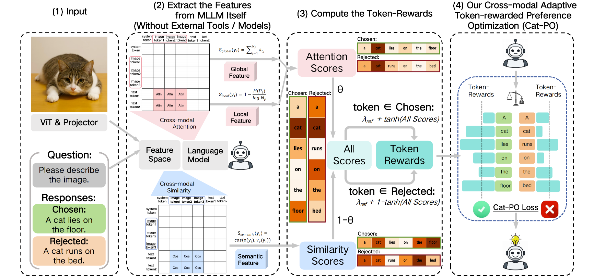

<div align="center">
 <h1> Cat-PO: Cross-modal Adaptive Token-rewards for Preference Optimization in Truthful Multimodal LLMs (ICLR 2026) </h1>

<a href="https://openreview.net/forum?id=iIbe6qDN0A"></a>
<a href="https://github.com/gavinzzx/CatPO"></a>

**Zhixiao Zheng**<sup>1</sup>, **Zheren Fu**<sup>1</sup>, **Zhiyuan Yao**<sup>1</sup>, **Dongming Zhang**<sup>2</sup>, **Zhendong Mao**<sup>1,*</sup>

<sup>1</sup> University of Science and Technology of China  
<sup>2</sup> State Key Laboratory of Communication Content Cognition, People’s Daily Online  


</div>


## Introduction
This repository provides the code and data for Cat-PO, which is a novel **multimodal preference optimization framework** based on cross-modal adaptive token-level rewards, thereby mitigating hallucinations and improving the truthfulness. The framework is shown below.

<p align="center">
  
</p>

We fully leverage the intrinsic cross-modal capabilities of MLLMs to compute the global, local, and semantic relevance between response tokens and visual content based on cross-modal attention, patch entropy, and semantic similarity, respectively. These relevance signals are then integrated to construct token-level rewards. Benefiting from this fine-grained reward mechanism, Cat-PO can more precisely reinforce visually critical tokens and suppress hallucinated tokens without relying on external tools or APIs. We conduct the experiments and validate the effectiveness of Cat-PO.


## Dataset and Model
- **Dataset**: We conducted experiments using the publicly available [RLHF-V Dataset](https://huggingface.co/datasets/openbmb/RLHF-V-Dataset).

- **Model**: We mainly conduct our experiments in the [LLaVA-v1.5](https://github.com/haotian-liu/llava) series.

## Training
Most of the configurations are already complete in `catpo.sh`. Let's start quickly with the following commands.

```
bash catpo.sh 
```

## Evaluation
We conduct the evaluation on the general and open-source benchmarks, such as [AMBER Bench](https://github.com/junyangwang0410/AMBER), [MM-Hal Bench](https://huggingface.co/datasets/Shengcao1006/MMHal-Bench). Use the official guide for configuration and testing.

On this page, we use `MM-Hal Bench` as an example and provide its core evaluation code below. First, we should download the images in [MM-Hal Bench images](https://huggingface.co/datasets/Shengcao1006/MMHal-Bench/tree/main/images). 


With most of the configurations are already complete in `mmhal.sh`, we can start quickly with the following commands.

```
bash evaluation/mmhal.sh 
```

## Citation

If you find Cat-PO useful for your research, please consider citing our papers 📝 and star us ⭐️！
```bibtex
@inproceedings{zheng2026catpo,
  title     = {Cat-{PO}: Cross-modal Adaptive Token-rewards for Preference Optimization in Truthful Multimodal {LLM}s},
  author    = {Zhixiao Zheng and Zheren Fu and Zhiyuan Yao and Dongming Zhang and Zhendong Mao},
  booktitle = {The Fourteenth International Conference on Learning Representations},
  year      = {2026},
  url       = {https://openreview.net/forum?id=iIbe6qDN0A}
}
```

## Acknowledgement
This repo is based on [SeVa](https://github.com/Kevinz-code/SeVa) and [RLHF-V](https://github.com/RLHF-V/RLHF-V). We thank them for their efforts in building their codebase.


